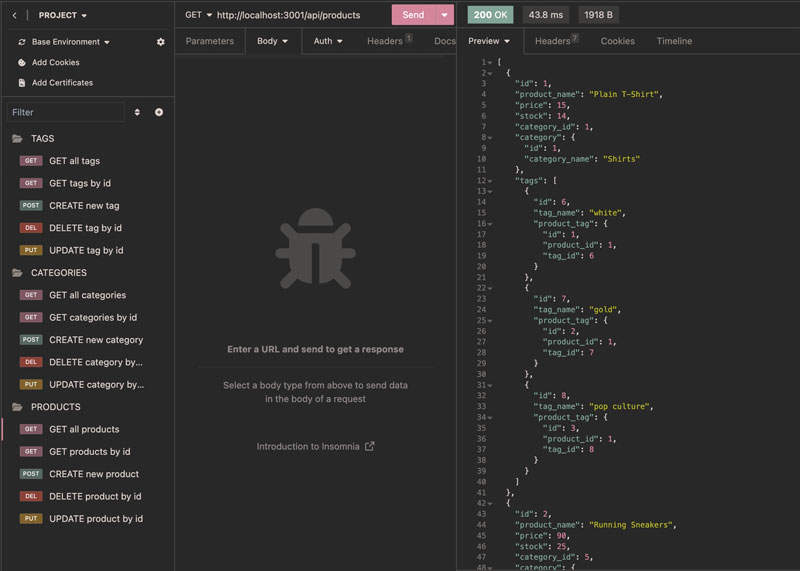

# E-commerce App Routing with Object Relational Mapping

This project sets the backend routing for CRUD requests on a basic e-commerce database, with products, product categories, and tags, using Sequelize and MySQL.

## Tech Stack

NodeJS, Express, MySQL, Sequelize, Dotenv.

## Installation Instructions

To use this template for your project, first create a .env file in your main directory and set the DB_NAME, DB_USER, and DB_PASSWORD. For this database, we're using "ecommerce_db" as the DB_NAME.

Then run 'npm i' to install the dependencies. In your MySQL server, run the query in db/schema.sql to create the database, and then run 'npm run seed' to add the initial seed data for testing the routes.

All the Sequelize models are in the /models folder, and you can use them as templates for adding more database tables to your app.

Now run 'npm start' to get the server going. Be sure to check the routes/api/ folder for comments on each of the route paths and their allowed CRUD requests.

Here's a screenshot of Insomnia, showing all of the route requests:

## Video Demo

[Watch this video demonstration of the app backend](https://youtu.be/7oZz-Emxls4)
